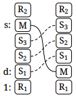
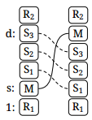

The item at source level *s* will be moved to destination level *d*. The items between them (including *d*) will move toward the gap at *s*.

For example, moving *M* up toward the tip of the stack. The *R*'s remain and the *S*'s are shifted toward *s*:

And moving down:

Move is reversed by running it again with *s* and *d* reversed.