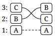
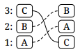
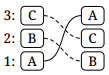
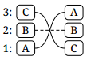

3. [Swap 1]

4. [Rotate]

5. [Unrotate]

6. [Circle]

## Listing

3. ABC → BCA
4. ABC → BAC
5. ABC → ACB
6. ABC → ABC

[swap 1]: swap-1.md
[rotate]: rotate.md
[unrotate]: unrotate.md
[circle]: circle.md