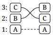

3. [swap+1][]

4. [rotate][]

5. [unrotate][]

6. [circle][]

## Listing

3. ABC → BCA
4. ABC → BAC
5. ABC → ACB
6. ABC → ABC

[swap+1]: instructions/swap+1
[rotate]: instructions/rotate
[unrotate]: instructions/unrotate
[circle]: instructions/circle