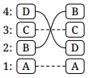

23. reverse4 (ABCD)

## Two levels at once

7. swap2 (CDAB)

17. rotate2 (BADC)

21. circle2 (ACBD)

## Skip first level

8. swap+2 (CDBA)

10. rotate+1 (CBDA)

13. unrotate+1 (BDCA)

15. circle+1 (BCDA)

## Four-level rolls

9. 4 [roll][] (CBAD)

20. 4 rolldown (ADCB)

## Changing insides and outsides

12. unswapout (CADB)

14. swapout (BDAC)

## Rollswapping

18. rollswap (BACD)

24. rolldownswap (ABDC)

## Unnamed

11. (CABD)

16. (BCAD)

19. (ADBC)

22. (ACDB)

## Listing

7. DCBA → CDAB
8. DCBA → CDBA
9. DCBA → CBAD
10. DCBA → CBDA
11. DCBA → CABD
12. DCBA → CADB
13. DCBA → BDCA
14. DCBA → BDAC
15. DCBA → BCDA
16. DCBA → BCAD
17. DCBA → BADC
18. DCBA → BACD
19. DCBA → ADBC
20. DCBA → ADCB
21. DCBA → ACBD
22. DCBA → ACDB
23. DCBA → ABCD
24. DCBA → ABDC

[swap]: swap.md
[rotate]: rotate.md
[unrotate]: unrotate.md
[circle]: circle.md
[roll]: roll.md