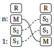

Level x becomes level 1. Everything below level x moves up the stack. This is an alias for [move x 1](move).

For example, roll 2 and 3:

Roll 1 is a no-op, since it would move level 1 to level 1. Roll 0 will pop an item off the stack.

Roll is reversed by [rolldown](rolldown).